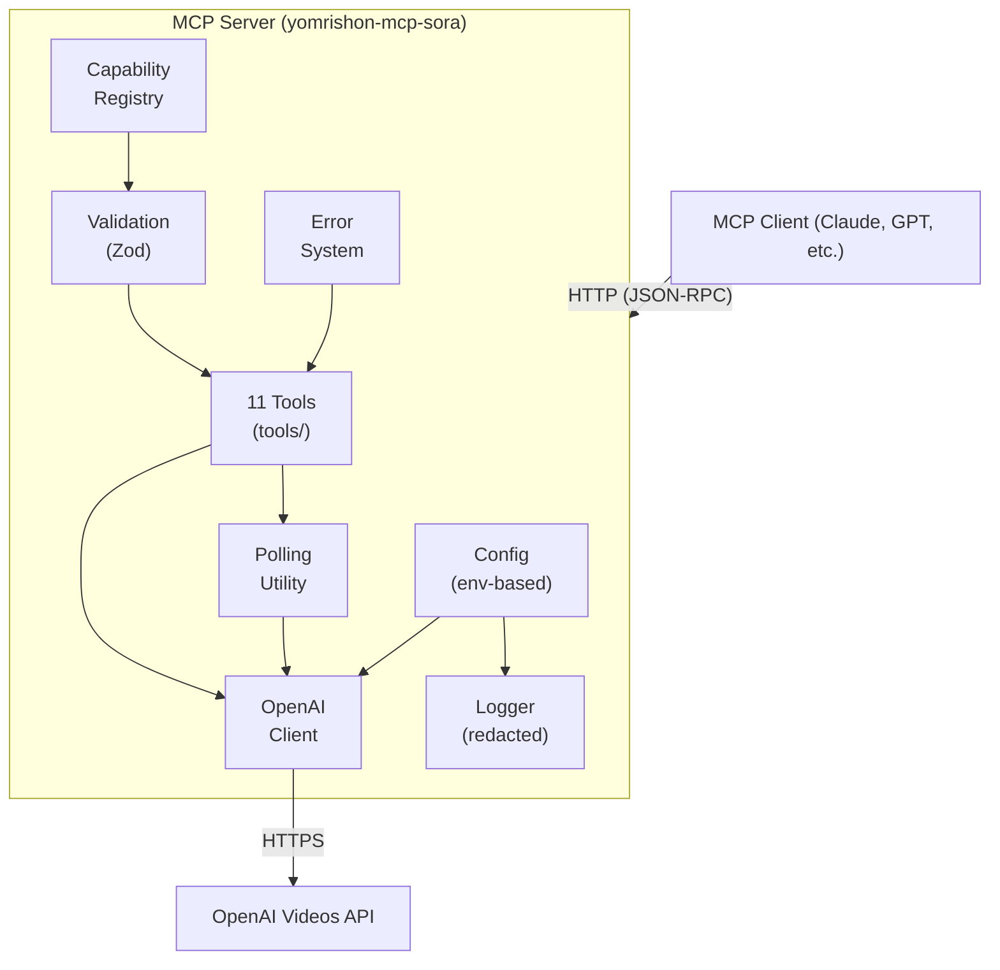

# yomrishon-mcp-sora

A production-ready **Model Context Protocol (MCP) server** for **OpenAI Sora 2** video generation.

Exposes Sora 2 video workflows as MCP tools so AI clients can generate, edit, extend, and manage videos safely and reliably.

---

## Architecture



### Key design principles

- **Centralized capabilities** — All model constraints (sizes, durations, features) live in `src/capabilities.ts`. Update only that file when OpenAI changes Sora 2.
- **Typed errors** — Seven error categories with human-readable messages and structured details.
- **Normalization** — All OpenAI API responses are normalized to consistent types before reaching tools.
- **Security** — API keys are never logged. File uploads are restricted to allowed directories. Authorization headers are redacted in debug output.

---

## Project structure

```
yomrishon-mcp-sora/
├── package.json
├── tsconfig.json
├── .env.example
├── README.md
└── src/
    ├── index.ts              # Entry point (HTTP server)
    ├── server.ts             # MCP server factory
    ├── http-server.ts        # Streamable HTTP transport server
    ├── request-context.ts    # Per-request client via AsyncLocalStorage
    ├── config.ts             # Environment configuration
    ├── types.ts              # Shared types (VideoJob, Character, etc.)
    ├── errors.ts             # Typed error system
    ├── logger.ts             # Structured logging with redaction
    ├── capabilities.ts       # Capability registry (single source of truth)
    ├── openai-client.ts      # OpenAI API adapter
    ├── validation.ts         # Zod schemas + validation helpers
    ├── polling.ts            # Poll-until-complete utility
    ├── download-tokens.ts    # Short-lived download token store
    └── tools/
        ├── index.ts                  # Tool registration orchestrator
        ├── create-video.ts           # sora_create_video
        ├── get-video.ts              # sora_get_video
        ├── list-videos.ts            # sora_list_videos
        ├── download-video.ts         # sora_download_video_content
        ├── edit-video.ts             # sora_edit_video
        ├── extend-video.ts           # sora_extend_video
        ├── create-character.ts       # sora_create_character
        ├── get-character.ts          # sora_get_character
        ├── wait-for-video.ts         # sora_wait_for_video
        ├── describe-capabilities.ts  # sora_describe_capabilities
        └── help-prompt.ts            # sora_help_prompt
```

---

## Setup

### Prerequisites

- Node.js ≥ 20
- An OpenAI API key with Sora 2 access

### Install

```bash
git clone <repo-url> && cd yomrishon-mcp-sora
npm install
npm run build
```

### Configure

```bash
cp .env.example .env
# Edit .env and set OPENAI_API_KEY
```

| Variable | Required | Default | Description |
|---|---|---|---|
| `OPENAI_API_KEY` | No | — | OpenAI API key (fallback when clients omit the Authorization header) |
| `OPENAI_BASE_URL` | No | `https://api.openai.com/v1` | API base URL |
| `SORA_DEFAULT_MODEL` | No | `sora-2` | Default model for generation |
| `SORA_MAX_POLL_SECONDS` | No | `300` | Max polling duration |
| `SORA_POLL_INTERVAL_MS` | No | `5000` | Polling interval |
| `SORA_DEBUG` | No | `false` | Enable debug logging |
| `SORA_ALLOWED_UPLOAD_DIRS` | No | `/tmp` | Comma-separated allowed upload directories |
| `MCP_HTTP_PORT` | No | `3000` | HTTP listen port |
| `MCP_HTTP_HOST` | No | `127.0.0.1` | HTTP listen host |

### Run

```bash
node dist/index.js
```

### Docker

```bash
# Build
docker build -t yomrishon-mcp-sora .

# Run
docker run -e OPENAI_API_KEY=sk-... yomrishon-mcp-sora
```

### CI/CD

A GitHub Actions workflow at `.github/workflows/docker-publish.yml` automatically builds and pushes the Docker image to Docker Hub on:

- Push to `main`
- Version tags (`v*`)
- Manual dispatch

**Required GitHub repo secrets:**

| Secret | Description |
|---|---|
| `DOCKERHUB_USERNAME` | Your Docker Hub username |
| `DOCKERHUB_TOKEN` | Docker Hub access token |

---

## MCP client configuration

### HTTP transport

The server exposes a Streamable HTTP endpoint.
Each request carries its own API key via the `Authorization` header, so a single server instance can serve many clients with different OpenAI accounts.

#### Start the server

```bash
MCP_HTTP_PORT=3000 node dist/index.js
```

Or with Docker:

```bash
docker run -p 3000:3000 \
  -e MCP_HTTP_HOST=0.0.0.0 \
  yomrishon-mcp-sora
```

#### Client configuration (HTTP)

Point your MCP client at the HTTP endpoint:

```json
{
  "mcpServers": {
    "sora": {
      "url": "http://localhost:3000/mcp",
      "headers": {
        "Authorization": "Bearer sk-..."
      }
    }
  }
}
```

#### Endpoints

| Method | Path | Description |
|---|---|---|
| `POST` | `/mcp` | MCP JSON-RPC endpoint (requires `Authorization: Bearer <key>`) |
| `GET` | `/mcp` | SSE stream for server-initiated messages |
| `DELETE` | `/mcp` | Session close (no-op in stateless mode) |
| `GET` | `/health` | Health check — returns `{"status":"ok"}` |
| `GET` | `/download/:token` | Proxy download — streams video content using a short-lived token (no API key needed) |

#### Security considerations for HTTP mode

- The server runs **stateless** — no session tokens or cookies are stored.
- Always deploy behind a TLS-terminating reverse proxy (nginx, Caddy, etc.) in production.
- `MCP_HTTP_HOST` defaults to `127.0.0.1` (loopback only). Set to `0.0.0.0` to accept remote connections.
- If `OPENAI_API_KEY` is set, it acts as a fallback when clients omit the header.

---

## Tools reference

### `sora_describe_capabilities`

**Call this first** to understand what parameters are valid.

```json
{}
```

Returns supported models, sizes, durations, and feature flags.

---

### `sora_create_video`

Create a new video generation job.

```json
{
  "prompt": "A golden retriever runs through a sunlit meadow at dawn. Slow tracking shot from the side, golden hour light streaming through tall grass. Cinematic, shallow depth of field, 35mm film grain.",
  "model": "sora-2-pro",
  "size": "1920x1080",
  "seconds": 8
}
```

With image reference:

```json
{
  "prompt": "The same landscape transforms from winter to spring. Time-lapse style, static camera.",
  "input_reference": {
    "type": "image_url",
    "url": "https://example.com/winter-landscape.jpg"
  },
  "seconds": 12
}
```

With characters (max 2 per video — mention character name in the prompt for best results):

```json
{
  "prompt": "Luna the astronaut floats through the space station corridor. Close-up tracking shot, blue ambient lighting.",
  "characters": [
    { "id": "char_abc123", "name": "Luna" }
  ],
  "seconds": 8
}
```

---

### `sora_get_video`

Check a job's status.

```json
{
  "video_id": "vid_abc123"
}
```

---

### `sora_wait_for_video`

Block until the job completes or times out.

```json
{
  "video_id": "vid_abc123",
  "poll_interval_ms": 5000,
  "max_wait_seconds": 120
}
```

---

### `sora_list_videos`

List recent jobs with optional pagination and ordering.

```json
{
  "limit": 10,
  "order": "desc"
}
```

---

### `sora_download_video_content`

Get a download URL for a completed video. Returns a proxy URL that can be used directly **without an API key**.

```json
{
  "video_id": "vid_abc123"
}
```

Returns:

```json
{
  "download_url": "http://localhost:3000/download/<token>",
  "content_type": "video/mp4",
  "expires_in_seconds": 600
}
```

The `download_url` is single-use and expires after 10 minutes. Call the tool again to get a fresh URL.

---

### `sora_edit_video`

Edit an existing video with a new prompt.

```json
{
  "source_video_id": "vid_abc123",
  "prompt": "Change the lighting to a warm sunset tone and slow the camera movement."
}
```

---

### `sora_extend_video`

Extend a completed video with additional footage (up to 20s per extension, max 6 extensions for 120s total).

```json
{
  "video_id": "vid_abc123",
  "prompt": "The camera continues to pan right, revealing a hidden waterfall behind the trees.",
  "seconds": 8
}
```

---

### `sora_create_character`

Upload a character from a short video clip (2–4s, 720p–1080p) for cross-shot consistency.

```json
{
  "name": "Luna",
  "file_path": "/tmp/luna-reference.mp4"
}
```

---

### `sora_get_character`

```json
{
  "character_id": "char_abc123"
}
```

---

### `sora_help_prompt`

Get a structured prompt brief from a rough idea. Does not call the API.

```json
{
  "idea": "a cat exploring a neon-lit Tokyo alley at night",
  "style": "cyberpunk",
  "constraints": ["no text", "single take"]
}
```

Returns a framework with sections (subject, action, setting, camera, lighting, style, continuity) plus composition tips and an example.

---

## Capability registry

All model capabilities are defined in `src/capabilities.ts`. When Sora 2 capabilities change:

1. Edit **only** `src/capabilities.ts`
2. Update model sizes, durations, feature flags as needed
3. Rebuild: `npm run build`

The capability file is extensively commented. Do **not** scatter capability checks throughout the codebase.

---

## Error categories

| Category | Description |
|---|---|
| `ValidationError` | Invalid user input (missing fields, bad types) |
| `CapabilityError` | Unsupported operation for selected model |
| `OpenAIAPIError` | Upstream API call failed |
| `RateLimitError` | OpenAI rate-limited the request |
| `AssetError` | File/asset issue (missing, wrong type, expired) |
| `TimeoutError` | Polling timed out before completion |
| `NotFoundError` | Requested resource not found |

All errors include a `category`, `message`, and optional `details` with allowed values.

---

## Troubleshooting

**"OPENAI_API_KEY environment variable is required"**  
Set the key in your environment or MCP client config's `env` block.

**"Size X is not supported for model Y"**  
Call `sora_describe_capabilities` to see valid sizes for your model.

**"Video did not reach terminal status within Ns"**  
Video generation can take minutes. Increase `max_wait_seconds` or use `sora_get_video` to poll manually.

**"File path is outside allowed upload directories"**  
Set `SORA_ALLOWED_UPLOAD_DIRS` to include your upload directory.

**Debug mode**  
Set `SORA_DEBUG=true` to see full request/response bodies in stderr logs (API keys are still redacted).

---

## Security notes

- API keys are loaded from environment variables only and never logged
- Authorization headers are redacted in all log output
- File uploads are restricted to explicitly configured directories (`SORA_ALLOWED_UPLOAD_DIRS`)
- File extension validation prevents uploading non-video files as characters
- No arbitrary URL fetching — remote references go directly to OpenAI's API
- Video download URLs use single-use, time-limited tokens (10-minute expiry) — the upstream API key is never exposed to clients
- In HTTP mode, deploy behind a TLS-terminating reverse proxy; `MCP_HTTP_HOST` defaults to loopback (`127.0.0.1`)

---

## License

MIT