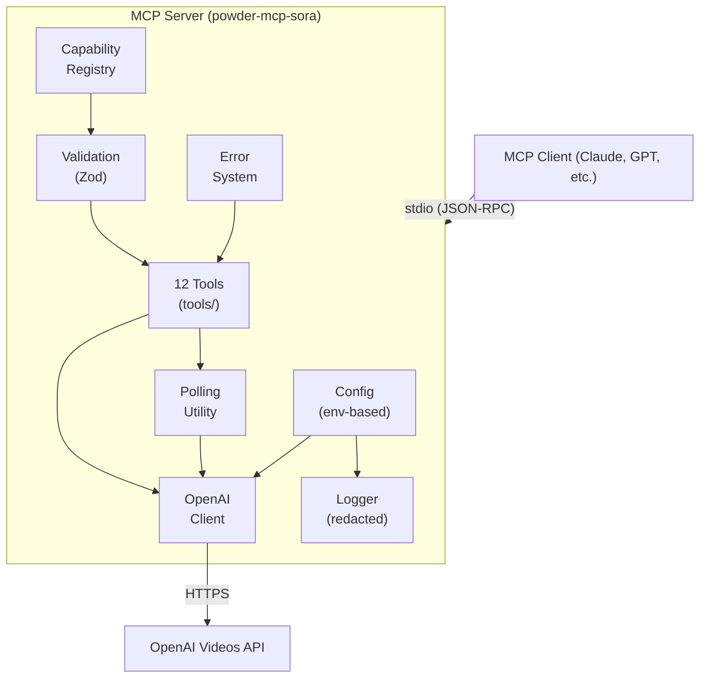

# powder-mcp-sora

A production-ready **Model Context Protocol (MCP) server** for **OpenAI Sora 2** video generation.

Exposes Sora 2 video workflows as MCP tools so AI clients can generate, edit, extend, and manage videos safely and reliably.

---

## Architecture



### Key design principles

- **Centralized capabilities** — All model constraints (sizes, durations, features) live in `src/capabilities.ts`. Update only that file when OpenAI changes Sora 2.
- **Typed errors** — Seven error categories with human-readable messages and structured details.
- **Normalization** — All OpenAI API responses are normalized to consistent types before reaching tools.
- **Security** — API keys are never logged. File uploads are restricted to allowed directories. Authorization headers are redacted in debug output.

---

## Project structure

```
powder-mcp-sora/
├── package.json
├── tsconfig.json
├── .env.example
├── README.md
└── src/
    ├── index.ts              # Entry point
    ├── server.ts             # MCP server factory
    ├── config.ts             # Environment configuration
    ├── types.ts              # Shared types (VideoJob, Character, etc.)
    ├── errors.ts             # Typed error system
    ├── logger.ts             # Structured logging with redaction
    ├── capabilities.ts       # Capability registry (single source of truth)
    ├── openai-client.ts      # OpenAI API adapter
    ├── validation.ts         # Zod schemas + validation helpers
    ├── polling.ts            # Poll-until-complete utility
    └── tools/
        ├── index.ts              # Tool registration orchestrator
        ├── create-video.ts       # sora_create_video
        ├── get-video.ts          # sora_get_video
        ├── list-videos.ts        # sora_list_videos
        ├── download-video.ts     # sora_download_video_content
        ├── edit-video.ts         # sora_edit_video
        ├── extend-video.ts       # sora_extend_video
        ├── create-character.ts   # sora_create_character
        ├── get-character.ts      # sora_get_character
        ├── wait-for-video.ts     # sora_wait_for_video
        ├── remix-video.ts        # sora_remix_video (deprecated)
        ├── describe-capabilities.ts  # sora_describe_capabilities
        └── help-prompt.ts        # sora_help_prompt
```

---

## Setup

### Prerequisites

- Node.js ≥ 20
- An OpenAI API key with Sora 2 access

### Install

```bash
git clone <repo-url> && cd powder-mcp-sora
npm install
npm run build
```

### Configure

```bash
cp .env.example .env
# Edit .env and set OPENAI_API_KEY
```

| Variable | Required | Default | Description |
|---|---|---|---|
| `OPENAI_API_KEY` | **Yes** | — | Your OpenAI API key |
| `OPENAI_BASE_URL` | No | `https://api.openai.com/v1` | API base URL |
| `SORA_DEFAULT_MODEL` | No | `sora-2` | Default model for generation |
| `SORA_MAX_POLL_SECONDS` | No | `300` | Max polling duration |
| `SORA_POLL_INTERVAL_MS` | No | `5000` | Polling interval |
| `SORA_DEBUG` | No | `false` | Enable debug logging |
| `SORA_ALLOWED_UPLOAD_DIRS` | No | `/tmp` | Comma-separated allowed upload directories |

### Run

```bash
# Direct
node dist/index.js

# Or via npm
npm start
```

### Docker

```bash
# Build
docker build -t powder-mcp-sora .

# Run
docker run -e OPENAI_API_KEY=sk-... powder-mcp-sora
```

### CI/CD

A GitHub Actions workflow at `.github/workflows/docker-publish.yml` automatically builds and pushes the Docker image to Docker Hub on:

- Push to `main`
- Version tags (`v*`)
- Manual dispatch

**Required GitHub repo secrets:**

| Secret | Description |
|---|---|
| `DOCKERHUB_USERNAME` | Your Docker Hub username |
| `DOCKERHUB_TOKEN` | Docker Hub access token |

---

## MCP client configuration

### Claude Desktop / VS Code

Add to your MCP settings (e.g., `claude_desktop_config.json` or VS Code MCP settings):

```json
{
  "mcpServers": {
    "sora": {
      "command": "node",
      "args": ["/absolute/path/to/powder-mcp-sora/dist/index.js"],
      "env": {
        "OPENAI_API_KEY": "sk-..."
      }
    }
  }
}
```

### With npx (if published)

```json
{
  "mcpServers": {
    "sora": {
      "command": "npx",
      "args": ["powder-mcp-sora"],
      "env": {
        "OPENAI_API_KEY": "sk-..."
      }
    }
  }
}
```

---

## Tools reference

### `sora_describe_capabilities`

**Call this first** to understand what parameters are valid.

```json
{}
```

Returns supported models, sizes, durations, and feature flags.

---

### `sora_create_video`

Create a new video generation job.

```json
{
  "prompt": "A golden retriever runs through a sunlit meadow at dawn. Slow tracking shot from the side, golden hour light streaming through tall grass. Cinematic, shallow depth of field, 35mm film grain.",
  "model": "sora-2",
  "size": "1920x1080",
  "seconds": 10
}
```

With image reference:

```json
{
  "prompt": "The same landscape transforms from winter to spring. Time-lapse style, static camera.",
  "input_reference": {
    "type": "image_url",
    "url": "https://example.com/winter-landscape.jpg"
  },
  "seconds": 15
}
```

With characters:

```json
{
  "prompt": "Luna the astronaut floats through the space station corridor. Close-up tracking shot, blue ambient lighting.",
  "characters": [
    { "id": "char_abc123", "name": "Luna" }
  ],
  "seconds": 10
}
```

---

### `sora_get_video`

Check a job's status.

```json
{
  "video_id": "vid_abc123"
}
```

---

### `sora_wait_for_video`

Block until the job completes or times out.

```json
{
  "video_id": "vid_abc123",
  "poll_interval_ms": 5000,
  "max_wait_seconds": 120
}
```

---

### `sora_list_videos`

List recent jobs with optional filters.

```json
{
  "status": "completed",
  "model": "sora-2",
  "limit": 10
}
```

---

### `sora_download_video_content`

Get a download URL for a completed video.

```json
{
  "video_id": "vid_abc123"
}
```

Returns `{ url, content_type, expires_at }`. Download before the URL expires.

---

### `sora_edit_video`

Edit an existing video with a new prompt.

```json
{
  "source_video_id": "vid_abc123",
  "prompt": "Change the lighting to a warm sunset tone and slow the camera movement.",
  "model": "sora-2"
}
```

---

### `sora_extend_video`

Extend a completed video with additional footage.

```json
{
  "video_id": "vid_abc123",
  "prompt": "The camera continues to pan right, revealing a hidden waterfall behind the trees.",
  "seconds": 10
}
```

---

### `sora_create_character`

Upload a character for cross-shot consistency.

```json
{
  "name": "Luna",
  "file_path": "/tmp/luna-reference.mp4",
  "description": "Female astronaut, short dark hair, blue flight suit"
}
```

Or from a previously uploaded file:

```json
{
  "name": "Luna",
  "file_id": "file_abc123",
  "description": "Female astronaut, short dark hair, blue flight suit"
}
```

---

### `sora_get_character`

```json
{
  "character_id": "char_abc123"
}
```

---

### `sora_remix_video`

> **Deprecated** — use `sora_edit_video` instead.

```json
{
  "source_video_id": "vid_abc123",
  "prompt": "Same scene but in anime style.",
  "model": "sora-2"
}
```

---

### `sora_help_prompt`

Get a structured prompt brief from a rough idea. Does not call the API.

```json
{
  "idea": "a cat exploring a neon-lit Tokyo alley at night",
  "style": "cyberpunk",
  "constraints": ["no text", "single take"]
}
```

Returns a framework with sections (subject, action, setting, camera, lighting, style, continuity) plus composition tips and an example.

---

## Capability registry

All model capabilities are defined in `src/capabilities.ts`. When Sora 2 capabilities change:

1. Edit **only** `src/capabilities.ts`
2. Update model sizes, durations, feature flags as needed
3. Rebuild: `npm run build`

The capability file is extensively commented. Do **not** scatter capability checks throughout the codebase.

---

## Error categories

| Category | Description |
|---|---|
| `ValidationError` | Invalid user input (missing fields, bad types) |
| `CapabilityError` | Unsupported operation for selected model |
| `OpenAIAPIError` | Upstream API call failed |
| `RateLimitError` | OpenAI rate-limited the request |
| `AssetError` | File/asset issue (missing, wrong type, expired) |
| `TimeoutError` | Polling timed out before completion |
| `NotFoundError` | Requested resource not found |

All errors include a `category`, `message`, and optional `details` with allowed values.

---

## Troubleshooting

**"OPENAI_API_KEY environment variable is required"**  
Set the key in your environment or MCP client config's `env` block.

**"Size X is not supported for model Y"**  
Call `sora_describe_capabilities` to see valid sizes for your model.

**"Video did not reach terminal status within Ns"**  
Video generation can take minutes. Increase `max_wait_seconds` or use `sora_get_video` to poll manually.

**"File path is outside allowed upload directories"**  
Set `SORA_ALLOWED_UPLOAD_DIRS` to include your upload directory.

**Debug mode**  
Set `SORA_DEBUG=true` to see full request/response bodies in stderr logs (API keys are still redacted).

---

## Security notes

- API keys are loaded from environment variables only and never logged
- Authorization headers are redacted in all log output
- File uploads are restricted to explicitly configured directories (`SORA_ALLOWED_UPLOAD_DIRS`)
- File extension validation prevents uploading non-video files as characters
- No arbitrary URL fetching — remote references go directly to OpenAI's API
- The server runs over stdio transport only (no network listener)

---

## License

MIT